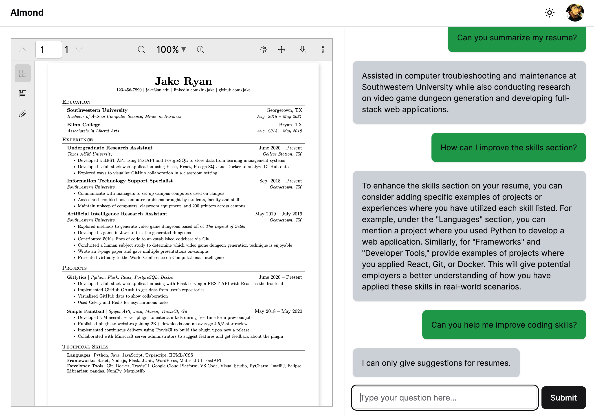

# Almond

Almond is a RAG application for providing contextual and useful suggestions to optimize your resume.

## Features

1. Google/GitHub login support
2. Sophisticated PDF uploader&viewer
3. Smooth chatting with ChatGPT
4. Responsive UI design
5. Light/Dark mode

## Contributing

Feel free to [open an issue](https://github.com/iamgodot/almond/issues) or submit a pull request.

## License

